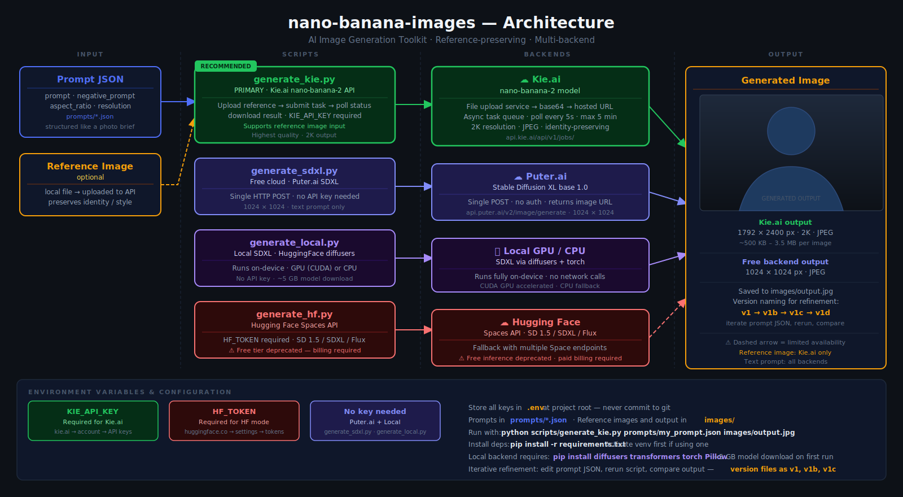

# nano-banana-images

An AI image generation and restoration toolkit that turns natural language descriptions into photorealistic images using structured JSON prompts. Supports multiple backends: Kie.ai, Google Gemini API, free cloud SDXL, and local generation.

## Demos

**API path** — natural language → structured JSON → API call → image saved:


**Gemini web UI path** — natural language → structured plain text → paste into Gemini:


## Architecture



## How It Works

You describe what you want in plain English, the tool asks how you want to generate the image, and then creates the right prompt format for your chosen path.

### Step 1: Describe What You Want

Tell Claude Code (or any AI assistant with the `nano-banana-images` skill) what image you want:

> "Create a candid photo of a woman jumping in the air with joy in a park, golden afternoon light, shallow depth of field"

### Step 2: Choose Your Output Path

The tool asks which generation method you want to use:

- **API** (Kie.ai, Gemini API, etc.) — the tool creates a **structured JSON prompt** saved to `prompts/`, then runs the generation script to call the API, generate the image, and save it to `images/`
- **Gemini web UI** — the tool creates a **structured plain-text prompt** that you copy/paste directly into [gemini.google.com](https://gemini.google.com)

Both paths produce the same level of detail — explicit photography parameters (lens, aperture, ISO, lighting direction, depth of field, skin texture) and negative constraints that neutralize AI model biases (over-smoothing, "plastic" skin, dataset-averaging).

### Path A: API Generation (automated)

The tool creates a structured JSON prompt and saves it to `prompts/`:

```json
{
  "prompt": "Candid documentary-style photograph of a woman in her late 20s mid-jump..., 35mm lens at f/2.8, ISO 400, 1/1000s shutter speed...",
  "negative_prompt": "plastic skin, skin smoothing, airbrushed texture, beauty filter, studio lighting...",
  "image_input": [],
  "api_parameters": {
    "resolution": "2K",
    "output_format": "jpg",
    "aspect_ratio": "4:5"
  },
  "settings": {
    "resolution": "2K",
    "style": "documentary realism, candid photography",
    "lighting": "natural afternoon daylight, warm directional",
    "camera_angle": "slightly below eye level, 35mm lens f/2.8 ISO 400",
    "depth_of_field": "shallow, subject sharp, background bokeh",
    "quality": "high detail, unretouched, authentic motion"
  }
}
```

Then runs the generation script:

```bash
# Via Kie.ai API (highest quality)
python scripts/generate_kie.py prompts/woman_jumping_joy.json images/output.jpg

# Via Google Gemini API
python scripts/generate_gemini.py prompts/woman_jumping_joy.json images/output.jpg
```

The script:
1. Loads the JSON prompt
2. Uploads any reference images (if `image_input` is provided)
3. Sends the prompt to the API
4. Polls for completion (Kie.ai) or waits for response (Gemini)
5. Downloads and saves the generated image to `images/`

### Path B: Gemini Web UI (manual, free, no API key)

The tool creates a structured plain-text prompt with the same photography parameters and negative constraints. You then:

1. Go to [gemini.google.com](https://gemini.google.com)
2. Paste the prompt text into the chat
3. Upload any reference images alongside the text
4. Download the generated image from Gemini's response

You can also convert an existing JSON prompt to plain text using `export_prompt.py`:

```bash
python scripts/export_prompt.py prompts/woman_jumping_joy.json
```

## Image Restoration

Restore and enhance scanned vintage film photographs — upscale to 4K, sharpen, color-correct, and remove artifacts without altering content.

### What Restoration Does

The restoration prompt instructs the model to:

1. **Analyze** — evaluate resolution, sharpness, noise, color balance, grain, dust/scratches
2. **Upscale to 4K** — 3840px long edge, maintain aspect ratio, reconstruct detail from existing pixels only
3. **Sharpen** — unsharp mask + detail recovery, restore edge crispness, enhance micro-contrast
4. **Color correct** — neutralize aged film dye color casts, restore white balance, recover shadow/highlight detail
5. **Remove artifacts** — film grain, dust specks, scratches, and scanning artifacts

Strict constraints are enforced: no content alteration, no hallucinated details, no composition changes. The model can only upscale, sharpen, color-correct, and remove artifacts.

### How to Restore an Image

Tell Claude Code (with the `nano-banana-image-restoration` skill) that you want to restore a photo:

> "Restore this scanned family photo: images/old_family_photo.jpg"

The tool asks which restoration method you want to use:

- **API** (Kie.ai, Gemini API) — the tool adds your source image to the `image_input` array in `prompts/image_restoration.json`, then runs the generation script to restore the image and save it to `images/`
- **Gemini web UI** — the tool provides the structured plain-text restoration prompt from `prompts/image_restoration_plain_text.txt` for you to copy/paste into [gemini.google.com](https://gemini.google.com) alongside your uploaded photo

### Path A: API Restoration (automated)

The tool updates `image_restoration.json` with your source image path and runs the script:

```bash
# Via Kie.ai
python scripts/generate_kie.py prompts/image_restoration.json images/restored_output.png

# Via Gemini API
python scripts/generate_gemini.py prompts/image_restoration.json images/restored_output.png
```

Output: PNG at 4K resolution saved to `images/`.

### Path B: Gemini Web UI Restoration (manual, free, no API key)

1. Go to [gemini.google.com](https://gemini.google.com)
2. Upload your scanned photo
3. Paste the contents of `prompts/image_restoration_plain_text.txt` alongside it
4. Download the restored image from Gemini's response

### Restoration Prompt Files

| File | Format | Use With |
|------|--------|----------|
| `prompts/image_restoration.json` | Structured JSON | API backends (`generate_kie.py`, `generate_gemini.py`) |
| `prompts/image_restoration_plain_text.txt` | Plain text | Copy/paste into Gemini web UI |

## Backends

| Script | Provider | API Key | Prompt Input | Quality | Speed |
|--------|----------|---------|--------------|---------|-------|
| `generate_kie.py` | Kie.ai (nano-banana-2) | `KIE_API_KEY` | JSON file | Highest | Fast |
| `generate_gemini.py` | Google Gemini API | `GEMINI_API_KEY` | JSON file | Highest | Fast |
| `generate_sdxl.py` | Puter.ai (SDXL) | None | Plain text string | Good | Fast |
| `generate_local.py` | Local SDXL (diffusers) | None | Plain text string | Good | Slow |
| `generate_hf.py` | Hugging Face | `HF_TOKEN` | Plain text string | Good | Varies |
| `export_prompt.py` | Gemini web UI (copy/paste) | None | JSON file → text | Highest | Manual |

**Note:** `generate_sdxl.py`, `generate_local.py`, and `generate_hf.py` accept a plain text prompt string (not a JSON file). For these backends, you can extract the prompt text from a JSON file or write it directly.

## Project Structure

```
nano-banana-images/
├── scripts/
│   ├── generate_kie.py                    # Kie.ai nano-banana-2 API
│   ├── generate_gemini.py                 # Google Gemini API (direct)
│   ├── generate_sdxl.py                   # Free cloud SDXL via Puter.ai
│   ├── generate_local.py                  # Free local SDXL via diffusers
│   ├── generate_hf.py                     # Hugging Face Spaces
│   └── export_prompt.py                   # Convert JSON prompt → plain text
├── prompts/
│   ├── image_restoration.json             # Restoration prompt (for API backends)
│   ├── image_restoration_plain_text.txt   # Restoration prompt (for Gemini web UI)
│   └── *.json                             # Image generation prompts
├── images/
│   └── *.jpg / *.png                      # Reference inputs + generated outputs
├── demo/
│   ├── demo_api_path.gif                  # Demo: API path workflow
│   └── demo_gemini_ui_path.gif            # Demo: Gemini web UI path workflow
├── docs/
│   └── architecture.svg                   # Architecture diagram
├── .env                                   # API keys (not committed)
└── requirements.txt
```

## Quick Start

### 1. Clone and install

```bash
git clone https://github.com/Gil80/nano-banana-images.git
cd nano-banana-images
python -m venv .venv && source .venv/bin/activate
pip install -r requirements.txt
```

### 2. Configure API keys

Copy `.env.example` to `.env` and add your keys:

```
KIE_API_KEY=your_key_here
GEMINI_API_KEY=your_key_here
```

### 3. Describe what you want and choose a path

Ask Claude Code (with the `nano-banana-images` skill) to create an image:

> "Create a candid portrait of a woman jumping with joy in a park"

The tool will ask whether you want to generate via **API** or **Gemini web UI**, then create the appropriate structured prompt (JSON or plain text) and either run the generation script or output the text for you to paste.

For restoration, the prompts are already provided — just add your source image path to `image_restoration.json` and run the script, or copy `image_restoration_plain_text.txt` into Gemini web UI.

### 5. Iterate

Version your prompts to track improvements: `prompt_v1.json` → `prompt_v1b.json` → `prompt_v2.json`. Each version refines the parameters based on the output quality.

## Prompt JSON Schema

All JSON prompts follow this structure:

| Field | Required | Description |
|-------|----------|-------------|
| `prompt` | Yes | Dense, detailed text description with camera math (lens, aperture, ISO), lighting behavior, skin/texture directives, and negative commands |
| `negative_prompt` | Yes | Comma-separated list of things to avoid (AI artifacts, beauty filters, CGI, etc.) |
| `image_input` | No | Array of local file paths to reference images. Used for identity preservation (generation) or as the source photo (restoration) |
| `api_parameters.resolution` | No | `"1K"`, `"2K"`, or `"4K"` (default: `"1K"`) |
| `api_parameters.output_format` | No | `"jpg"` or `"png"` (default: `"jpg"`) |
| `api_parameters.aspect_ratio` | No | e.g. `"3:4"`, `"16:9"`, `"4:5"`, `"auto"` |
| `settings` | No | Metadata for style, lighting, camera angle, depth of field, quality |

## Key Concepts

- **Prompt creation first** — you describe what you want in natural language, choose your output path (API or Gemini web UI), and the tool constructs the appropriate structured prompt (JSON or plain text) with photography parameters, negative constraints, and generation settings
- **Reference image input** — provide a portrait and the model preserves facial features, style, or composition in the generated output
- **Image restoration** — provide a scanned vintage photo and the model upscales, sharpens, color-corrects, and removes artifacts without altering content
- **Structured prompts** — JSON format with explicit photography settings (focal length, aperture, lighting direction) neutralizes AI model biases and produces consistent results
- **Iterative refinement** — version your prompt files (`_v1`, `_v1b`, `_v1c`, `_v2`) to track what changes improve output quality
- **Multi-backend** — same JSON prompts work across Kie.ai, Gemini API, and Gemini web UI; SDXL backends accept the prompt text directly

## Environment Variables

| Variable | Required | Description |
|----------|----------|-------------|
| `KIE_API_KEY` | For Kie.ai | Kie.ai API key |
| `GEMINI_API_KEY` | For Gemini API | Google AI Studio API key |
| `HF_TOKEN` | For HF mode | Hugging Face token |

## License

MIT
